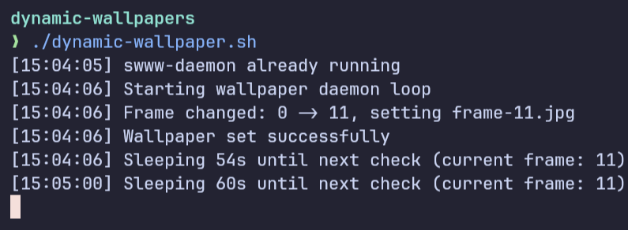

# dynamic-wallpaper
A minimal bash daemon that automatically changes wallpaper based on the time of day. Uses [swww](https://github.com/LGFae/swww) for smooth wallpaper transitions on Wayland.

<details>
<summary>Screenshots</summary>



</details>

## How it works
At startup, the script scans the wallpaper folder and automatically detects the total number of frames. The day (1440 minutes) is then divided into equal intervals based on that count. Every interval maps to one wallpaper frame. The daemon checks the current time every minute and switches the wallpaper when a new frame begins.

For example, with 8 frames:
```
00:00 – 03:00  →  frame-1
03:00 – 06:00  →  frame-2
...
21:00 – 24:00  →  frame-8
```

With 16 frames:
```
00:00 – 01:30  →  frame-1
01:30 – 03:00  →  frame-2
...
22:30 – 24:00  →  frame-16
```

The file extension is also detected automatically — `jpg`, `png`, `jpeg`, and `webp` are supported.

## Dependencies
- [swww](https://github.com/LGFae/swww) — installed and available in `$PATH`
- Wayland-compatible compositor (e.g. Hyprland)

## Wallpaper structure
Wallpapers must be placed inside a named subfolder:
```
~/Pictures/wallpapers/dynamic-wallpapers/{name}/
├── frame-1.jpg
├── frame-2.jpg
├── ...
└── frame-N.jpg
```

The subfolder name is set via the `WALLPAPER_NAME` variable at the top of the script:
```bash
WALLPAPER_NAME="my-wallpaper"
```

This resolves to:
```
~/Pictures/wallpapers/dynamic-wallpapers/my-wallpaper/
```

Any number of frames is supported — the script adapts the interval automatically.

## Installation
```bash
cp dynamic-wallpaper.sh ~/.local/share/bin/dynamic-wallpaper.sh
chmod +x ~/.local/share/bin/dynamic-wallpaper.sh
mkdir -p ~/Pictures/wallpapers/dynamic-wallpapers/my-wallpaper
cp wallpapers/* ~/Pictures/wallpapers/dynamic-wallpapers/my-wallpaper/
```

## Autostart
Add to `~/.config/hypr/hyprland.conf`:
```
exec-once = /home/user/.local/share/bin/dynamic-wallpaper.sh
```

## Debug
On startup, the script prints a summary and then logs its activity to stdout:
```
[12:00:01] swww-daemon already running
[12:00:01] Wallpaper set  : my-wallpaper
[12:00:01] Total frames   : 8
[12:00:01] File extension : .jpg
[12:00:01] Interval       : 180 min per frame (8 changes/day)
[12:00:01] Frame changed: 0 -> 4, setting frame-4.jpg
[12:00:01] Wallpaper set successfully
[12:00:01] Sleeping 59s until next check (current frame: 4 / 8)
```

To capture the output when launched via Hyprland, redirect it to a file:
```
exec-once = /home/user/.local/share/bin/dynamic-wallpaper.sh > /tmp/dynamic-wallpaper.log 2>&1
```
